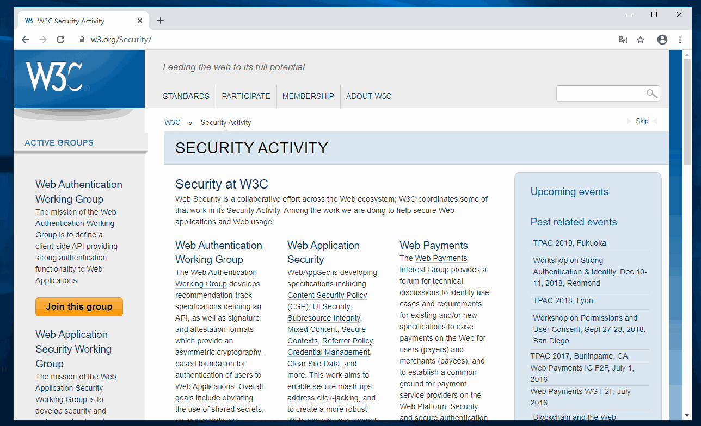
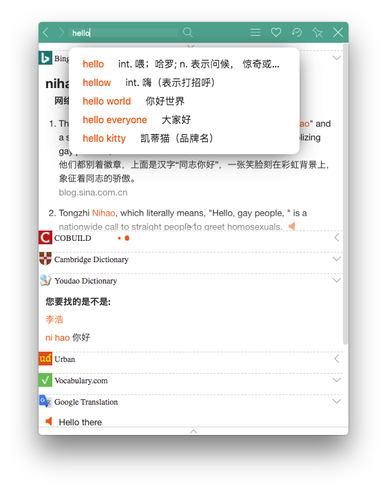
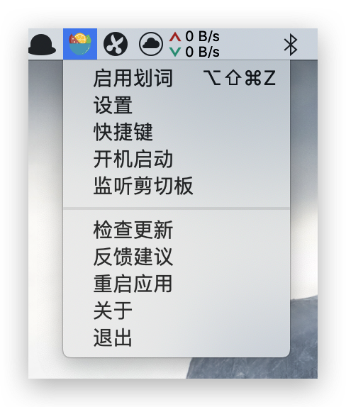
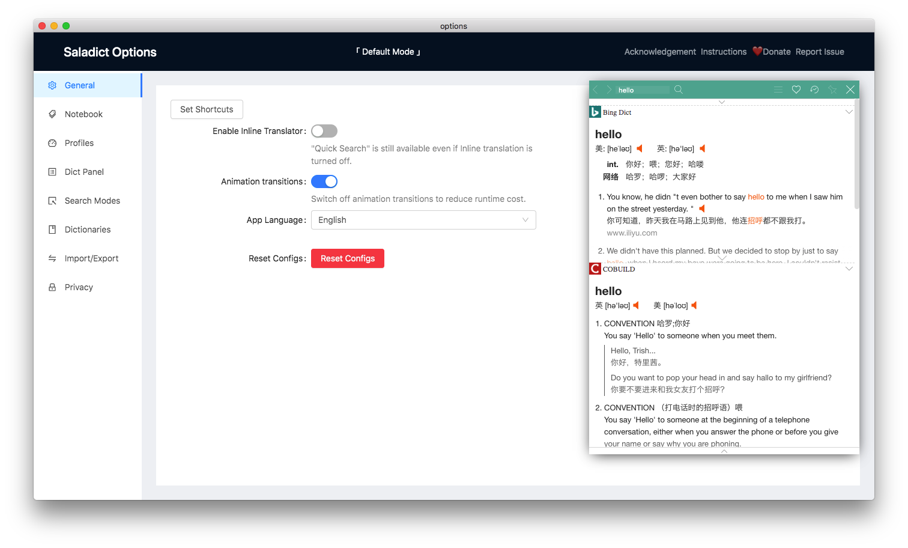
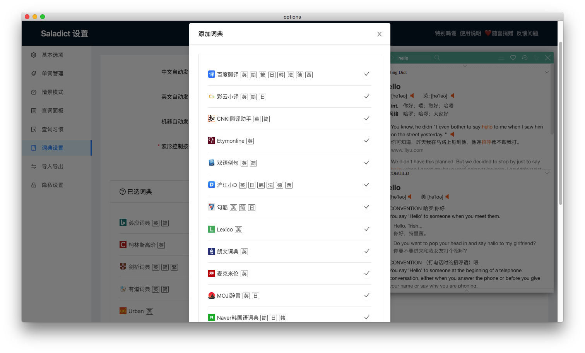

# saladict-desktop

> 基于[crimx/ext-saladict](https://github.com/crimx/ext-saladict)，聚合了 N 多词典的桌面翻译与划词工具，功能强大，支持 Windows 、 Mac 和 Linux。

[](https://github.com/zenghongtu/saladict-desktop/releases)


## 预览



## 功能

支持[crimx/ext-saladict](https://github.com/crimx/ext-saladict)的大部分功能

- 多词典切换
- 多种划词方式
- 历史记录
- 红心保存生词
- 剪切板监听（复制翻译）
- 等等...

## 部分截图

### 左击托盘图标



### 右击托盘图标



### 设置页




## 下一步

- OCR
- 自定义分词 （驼峰拆分）
- 变量命名
- ...

## 安装

[这里](https://github.com/zenghongtu/saladict-desktop/releases)去下载最新版本，或者下面的指定系统版本。

### Mac

[下载](https://github.com/zenghongtu/saladict-desktop/releases/download/v1.0.0/saladict-desktop-1.0.0.dmg) .dmg

### Window

[下载](https://github.com/zenghongtu/saladict-desktop/releases/download/v1.0.0/saladict-desktop-1.0.0.exe) .exe

### Linux

'Debian / Ubuntu' 使用 .deb [下载](https://github.com/zenghongtu/saladict-desktop/releases/download/v1.0.0/saladict-desktop_1.0.0_amd64.deb)

## 开发

```bash
# install dependencies
npm install

# serve with hot reload at localhost:9080
npm run dev

# build electron application for production
npm run build

# run tests
npm test

# lint all files in `src/`
npm run lint

```

## 其他

- 特别感谢 [crimx/ext-saladict](https://github.com/crimx/ext-saladict)
